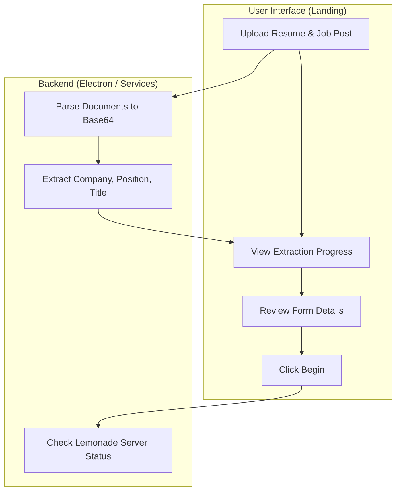
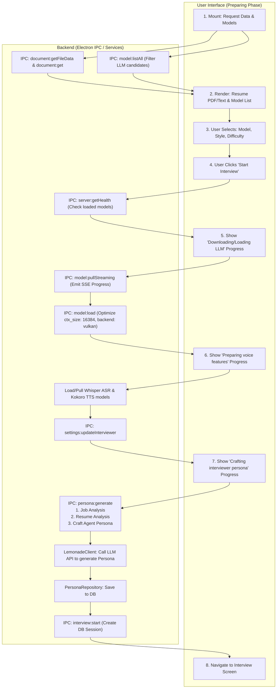
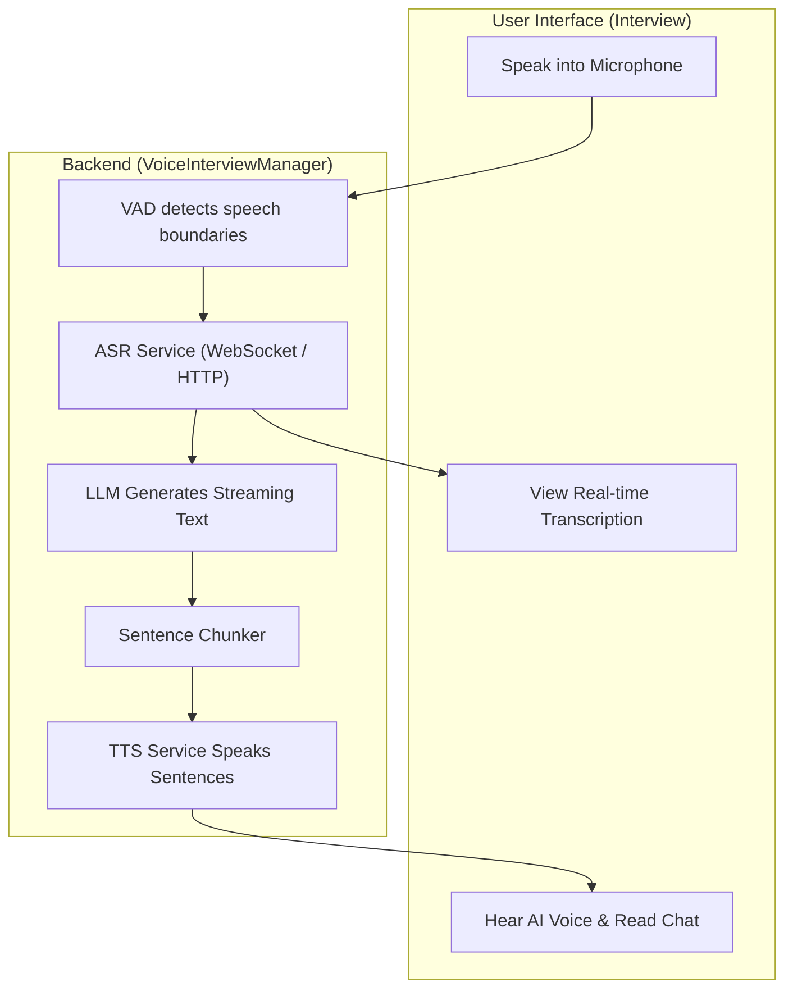

# 🏛️ Interviewer Flow and Architecture

Below are the architectural graphs for each phase of the application, detailing what the user sees on the frontend compared to what happens in the backend.

## 🛬 1. Landing Phase

**User View:** The user uploads a resume and job description. They see a form to review AI-extracted details (title, company, position, interview type) and click "Begin".
**Backend:** The Electron API parses the uploaded documents, triggers an extraction service to find details, and checks if the Lemonade Server is running.

## ⚙️ 2. Preparing Phase

**User View:** The user reviews their resume text/PDF, selects an LLM model, configures interview preferences (style, difficulty), and sees detailed progress states for model downloads, loading, and persona generation.
**Backend:** Fetches existing documents, pulls/loads LLM/ASR/TTS models into memory (optimizing context window). Prompts the LLM API to generate a custom interviewer persona based on the resume and job description. Creates the interview session in the DB.

## 🎙️ 3. Interview Phase

**User View:** The user interacts with the "Voice Orb", speaks or types messages, views real-time transcription deltas, and sees the interviewer's responses in a chat interface. They can end the interview to see feedback.
**Backend:** The `VoiceInterviewManager` handles streaming audio. It uses VAD (Voice Activity Detection) to detect speech, uses WebSockets or HTTP fallback to transcribe audio (ASR), sends text to the LLM, chunks the streaming response into sentences, and generates speech (TTS).

